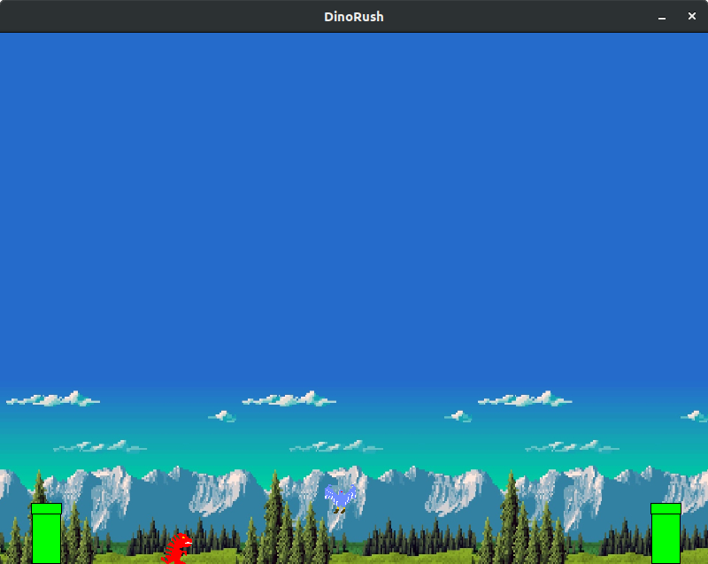

# DinoRush
Classic Google Chrome Dinosaur game using PyGame and OpenGL. Added incomplete textures. Needs some work. Mechanics are fully functional.
GUI to be added.

# Requirements :
<ul>Python3</ul>
<ul>PyGame</ul>
<ul>PyOpenGL</ul>

# How to run:
After installing all the required packages, just execute the main file using command "python3 main.py".

# Screenshot:

 
 

