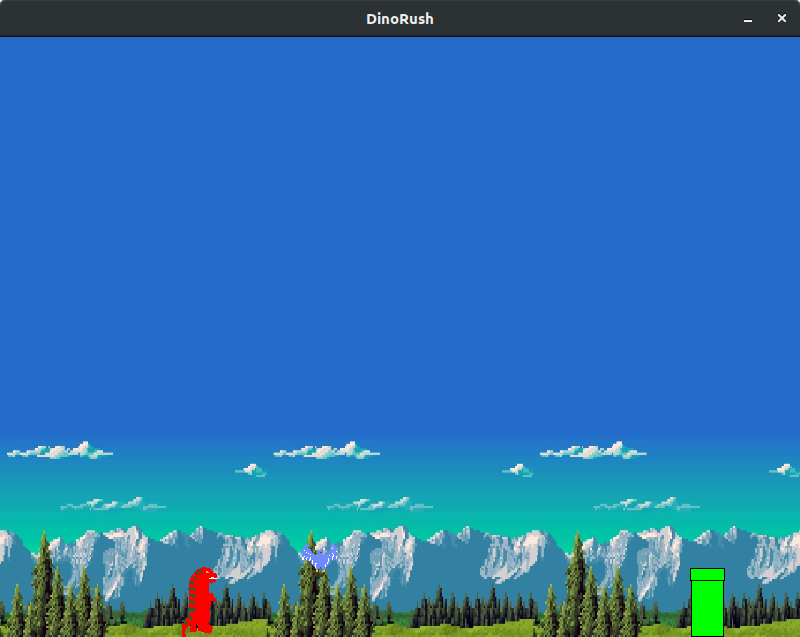

# DinoRush
Classic Google Chrome Dinosaur game using PyGame and OpenGL. Currently without textures.

#Requirements :
<ul>Python3
<ul>PyGame
<ul>PyOpenGL

#How to run:
After installing all the required packages, just execute the main file using command "python3 main.py".

#Screenshot:

